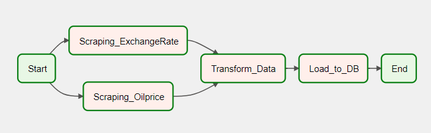

# Scheduled Pipeline to get oil price (USD) using Airflow 

== Steps ==
1. Scraping oil price (THB) for each fuel types (Gasohol91, 95, etc.) from sanook.com, save data as json into datalake
2. Scraping exchange rate (USD/THB) from bot.or.th, save data as csv into datalake
3. Create DataFrame of oil price and exchange rate
4. Rename columns
5. Transform date to be in format 'yyyy-mm-dd'
6. Merge oil price and exchange rate dataframe with date
7. Fill blank exchange rate with latest non-blank value
8. Convert oil price from THB to USD unit, by divide price columns by exchange rate, save result as csv file
9. Load data into database (in this example use SQLite)
10. Schedule Step 1-9 using Airflow to execute every midnight (0.00)
